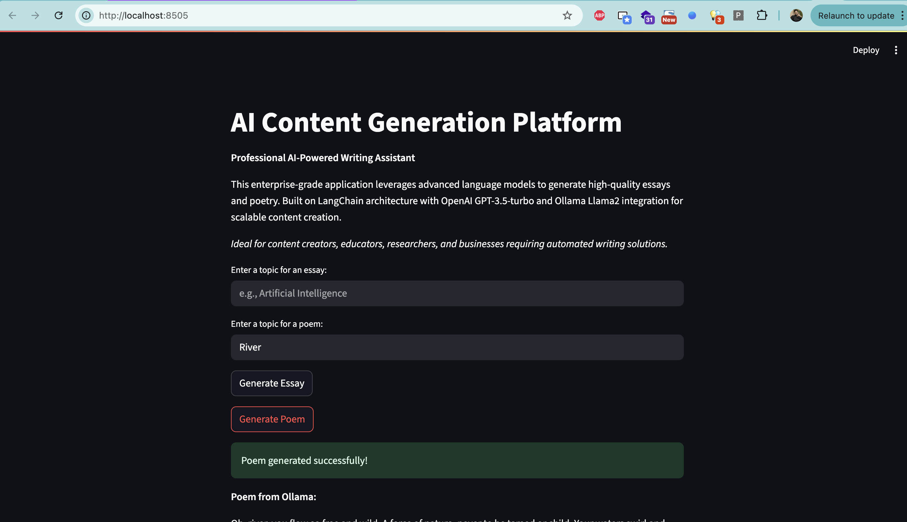

# LangChain Content Generation API

🚀 **What does this project do?**
This is a web application that automatically generates essays and poems using AI. You give it a topic, and it creates content for you using advanced language models like OpenAI's GPT and Ollama's Llama2.

🎯 **Perfect for:**
- Students needing writing inspiration
- Content creators looking for ideas
- Anyone wanting to experiment with AI writing
- Developers learning about AI APIs

**Tech Stack:** FastAPI (backend) + Streamlit (web interface) + LangChain (AI orchestration)

## 🌟 What Can This App Do?

### 📝 Essay Generator
- **Endpoint:** `/essay/invoke`
- **What it does:** Creates essays on any topic you want
- **Powered by:** OpenAI GPT-3.5-turbo (the smart AI behind ChatGPT)
- **Customizable:** Choose your word count (default: 100 words)
- **Example topics:** "Climate change", "History of pizza", "Why cats are better than dogs"

### 🎭 Poem Generator  
- **Endpoint:** `/poem/invoke`
- **What it does:** Writes poems about anything you can imagine
- **Powered by:** Ollama Llama2 (free, runs on your computer)
- **Customizable:** Target different audiences (kids, adults, professionals)
- **Example topics:** "Sunset over mountains", "My first day at school", "The future of technology"

### 🖥️ Web Interface
- **What it is:** A simple website where you can test everything
- **No coding required:** Just type your topic and click generate
- **Built with:** Streamlit (makes beautiful web apps from Python)


*Professional web interface for generating essays and poems with AI*

## 📁 Project Structure (What's in each folder?)

```
your-project/
├── api/                    # The main backend server
│   ├── app.py             # 🏠 Main server file (FastAPI endpoints live here)
│   └── client.py          # 🌐 Web interface (Streamlit app for testing)
├── chatbot/               # Extra demo apps
│   └── app.py             # 💬 Chatbot interface (for experimenting)
├── requirements.txt       # 📦 List of Python packages needed
├── .env                   # 🔐 Secret keys (you'll create this)
└── README.md             # 📖 This file!
```

### 🤔 What does each file do?

**`api/app.py`** - The brain of the operation
- Contains the essay and poem generation logic
- Handles requests from the web interface
- Connects to OpenAI and Ollama

**`api/client.py`** - The user-friendly website
- Simple forms to input your topics
- Shows generated content nicely formatted
- No technical knowledge needed to use

**`chatbot/app.py`** - Bonus chatbot demo
- Experimental conversational AI interface
- Great for testing different prompts and ideas

## 🛠️ What You Need Before Starting

### Required Software
- **Python 3.8 or newer** 
  - Check your version: `python --version`
  - Download from: https://python.org if needed

### Required API Keys (Don't worry, we'll show you how to get them!)

1. **OpenAI API Key** (for essay generation)
   - Go to: https://platform.openai.com/account/api-keys
   - Sign up/login and create a new key
   - ⚠️ **Important:** This costs money (~$0.002 per essay), but you get $5 free credit

2. **LangChain API Key** (for monitoring and debugging)
   - Go to: https://smith.langchain.com/
   - Sign up for free account
   - Create an API key in settings

3. **Ollama** (for poem generation - completely free!)
   - Download from: https://ollama.ai/
   - Install the Llama2 model: `ollama pull llama2`
   - This runs on your computer, no internet needed after download

### 💡 Beginner Tip
Don't have all the keys yet? No problem! You can start with just one service and add others later.

## 🚀 Getting Started (Step-by-Step for Beginners)

### Step 1: Download the Project
```bash
# Download the code to your computer
git clone <repository-url>
cd <repository-directory>

# 💡 New to Git? You can also download as ZIP from GitHub
```

### Step 2: Install Python Packages
```bash
# This installs all the AI libraries and tools we need
pip install -r requirements.txt

# 🔧 If you get permission errors, try: pip install --user -r requirements.txt
```

### Step 3: Create Your Secret Keys File
Create a new file called `.env` in your project folder and add your keys:

```plaintext
# Copy your actual keys here (remove the < > brackets)
LANGCHAIN_API_KEY=<your-langchain-api-key>
OPENAI_API_KEY=<your-openai-api-key>
LANGCHAIN_PROJECT=langchain_project
LANGCHAIN_TRACING_V2=true
```

**🔒 Security Note:** Never share this file or commit it to Git! It contains your private keys.

### Step 4: Start the AI Server
```bash
# This starts the backend server that handles AI requests
uvicorn api.app:app --host 127.0.0.1 --port 8000 --reload

# ✅ Success looks like: "Uvicorn running on http://127.0.0.1:8000"
```

### Step 5: Test Your API (Optional but Recommended)
Open your browser and go to: http://localhost:8000/docs

This shows you all available endpoints and lets you test them directly!

### Step 6: Launch the User-Friendly Website
Open a **new terminal** (keep the server running) and run:
```bash
# This starts the web interface
streamlit run api/client.py

# ✅ Success: Browser opens to http://localhost:8501
```

### 🎉 You're Done! 
Now you can generate essays and poems through the web interface!

## 💡 How to Use This App

### 🌐 Easy Way: Use the Web Interface
1. Go to http://localhost:8501 in your browser
2. Choose "Essay" or "Poem" from the sidebar
3. Type your topic (e.g., "Why pizza is the best food")
4. Click "Generate" and wait for the magic! ✨

### 🔧 Advanced Way: Use the API Directly

**Generate an Essay:**
```bash
curl -X POST "http://localhost:8000/essay/invoke" \
  -H "Content-Type: application/json" \
  -d '{
    "topic": "The Impact of Renewable Energy",
    "word_count": 150
  }'
```

**Generate a Poem:**
```bash
curl -X POST "http://localhost:8000/poem/invoke" \
  -H "Content-Type: application/json" \
  -d '{
    "topic": "Autumn Leaves",
    "audience": "young adult"
  }'
```

### 📝 Example Topics to Try
**Essays:**
- "The future of artificial intelligence"
- "Why learning to code is important"
- "The benefits of reading books"

**Poems:**
- "A rainy day" (audience: children)
- "First love" (audience: teenagers)  
- "Retirement dreams" (audience: adults)

## 🚨 Common Problems & Solutions

### "API Key Error" or "Authentication Failed"
**Problem:** Your API keys aren't working
**Solutions:**
- Double-check your `.env` file has the correct keys (no extra spaces!)
- Make sure you copied the full key (they're usually very long)
- Verify your OpenAI account has credits remaining
- Restart the server after changing `.env`

### "Connection Error" or "Ollama Not Found"
**Problem:** Can't connect to Ollama for poem generation
**Solutions:**
```bash
# Check if Ollama is installed
ollama --version

# Start Ollama service
ollama serve

# Download the model (if not done already)
ollama pull llama2

# Test if it's working
ollama run llama2 "Write a short poem about cats"
```

### "Port Already in Use" Error
**Problem:** Something else is using port 8000 or 8501
**Solutions:**
```bash
# Use different ports
uvicorn api.app:app --host 127.0.0.1 --port 8001 --reload
streamlit run api/client.py --server.port 8502
```

### "Module Not Found" Error
**Problem:** Missing Python packages
**Solutions:**
```bash
# Reinstall requirements
pip install -r requirements.txt

# If still failing, try upgrading pip first
pip install --upgrade pip
```

### 🆘 Still Stuck?
1. Check the terminal for error messages (they usually tell you what's wrong)
2. Make sure you're in the right directory (`ls` should show `api/` folder)
3. Try restarting everything (close terminals, start fresh)

### 📞 Getting Help
- Check the server logs in your terminal for detailed error messages
- Visit http://localhost:8000/docs to test individual endpoints
- Make sure all prerequisites are installed and running

## 🔄 Coming Back After Months?

### Quick Reminder Checklist
- [ ] Is Python still installed? (`python --version`)
- [ ] Are your API keys still valid? (Check OpenAI billing)
- [ ] Is Ollama still installed? (`ollama --version`)
- [ ] Start Ollama service: `ollama serve`
- [ ] Start the API server: `uvicorn api.app:app --reload`
- [ ] Start the web interface: `streamlit run api/client.py`

### 🎯 What This Project Does (Quick Refresh)
This app generates essays using OpenAI and poems using Ollama. You can use it through a web interface or API calls. Perfect for content creation, learning about AI, or just having fun with automated writing.

## 🚀 Next Steps & Ideas

### Want to Extend This Project?
- Add more AI models (Claude, Gemini, etc.)
- Create a blog post generator
- Add user authentication
- Save generated content to a database
- Add different writing styles (formal, casual, academic)

### Learning Opportunities
- **FastAPI:** Learn modern Python web development
- **LangChain:** Understand AI orchestration frameworks  
- **Streamlit:** Build beautiful data apps quickly
- **AI Integration:** Connect multiple AI services

## 📄 License

This project is licensed under the MIT License. See the [LICENSE](LICENSE) file for details.

---

**Made with ❤️ for developers learning AI integration**

*Last updated: Add the date when you make changes to help future you!*